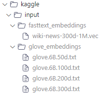

# Toxic-comment-classification

## Description

This project aims to classify toxic comments using machine learning techniques. It provides a solution to identify and filter out toxic comments from data collected on [Kaggle competition Toxic Comment Classification Challenge](https://www.kaggle.com/competitions/jigsaw-toxic-comment-classification-challenge).

## Features

- Preprocessing of text data to remove noise and irrelevant information.
- Training and evaluation of machine learning models for toxic comment classification.
- Integration with a user interface for easy interaction and input of comments.

## Installation

1. Clone the repository:

    ```bash
    git clone https://github.com/your-username/Toxic-comment-classification.git
    cd Toxic-comment-classification
    ```

2. Install the required dependencies:

    ```bash
    pip install -r requirements.txt
    ```

3. If you have a capable GPU, use a `conda` environment is advised:
    ```bash
    conda env create -f environment.yaml
    ```
    or if you prefer `pip`:
    ```bash
    pip install -r requirements2.txt
    ```


## Usage

1. Navigate to the project directory:

    ```bash
    cd Toxic-comment-classification
    ```
2. Inference:
    ```bash
    python demo/Demo_GUI.py
    ```

3. To try the demo, download the models folder from this [link](https://husteduvn-my.sharepoint.com/:f:/g/personal/thanh_lh225458_sis_hust_edu_vn/EnYcr9cjYF1FhrfrI0QiuAgB9y9S2THw8TqHsravmgRJrQ?e=zRB8Pq) and put it in the root folder. The `model_checkpoint` folder should be directly under the `Toxic-comment-classification` folder.

4. To train the models, download the .vec and .txt embedding files from the internet, and put it in the folder like this:




## Contributing

Contributions are welcome! If you find any issues or have suggestions for improvements, please open an issue or submit a pull request.

## License

This project is licensed under the MIT License. See the [LICENSE](LICENSE) file for more details.